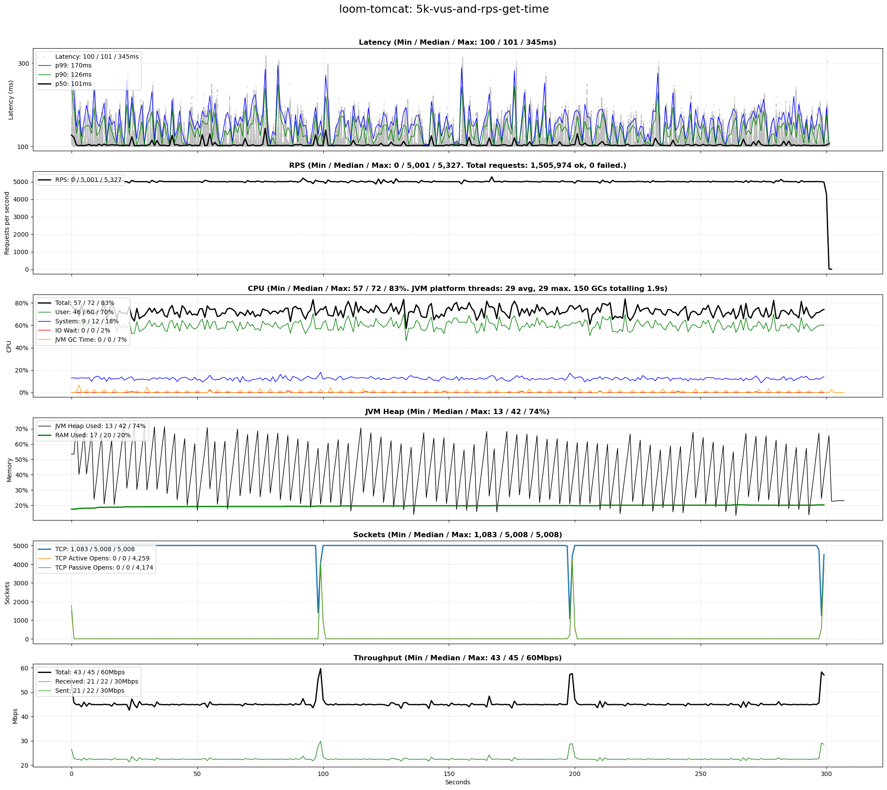
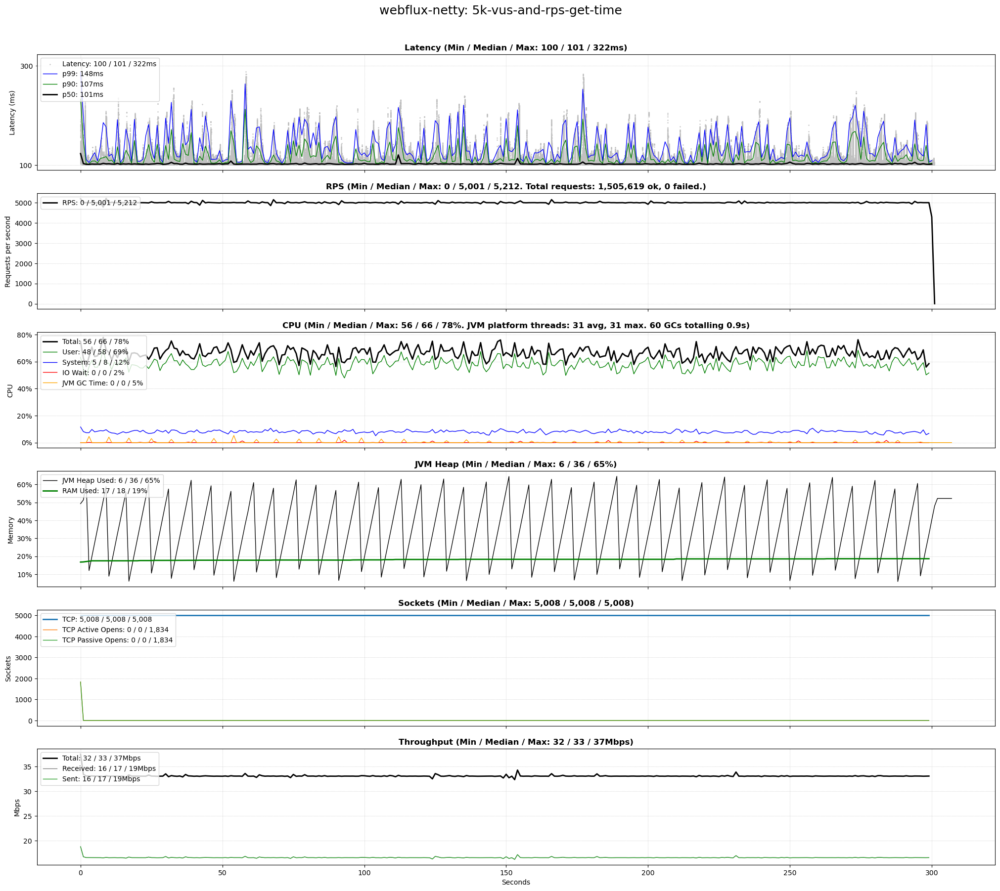
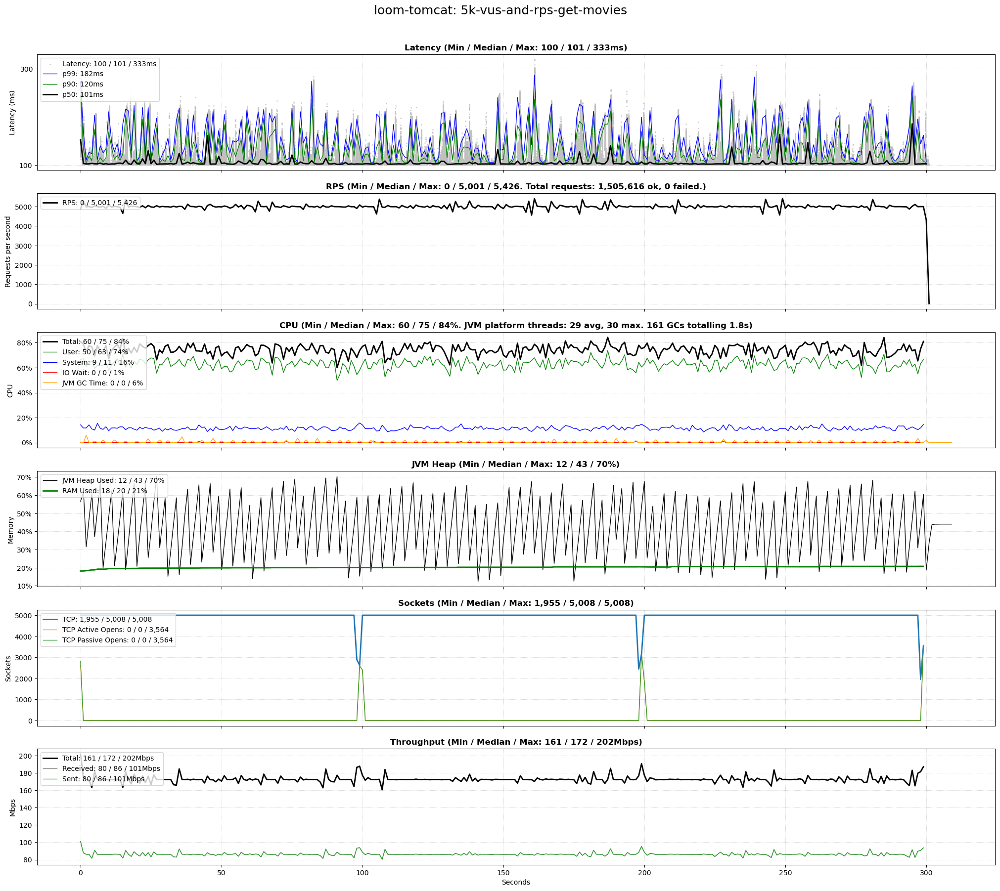
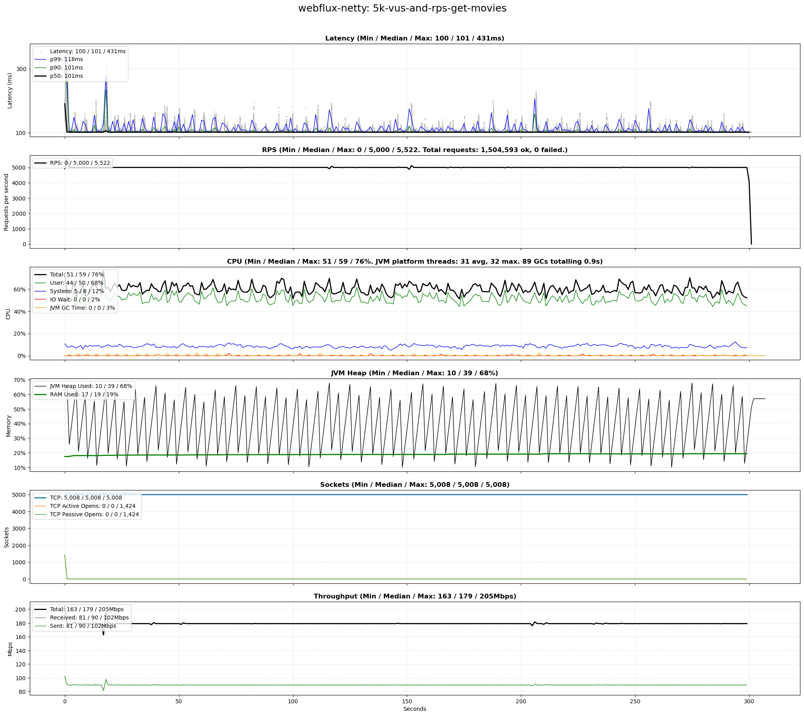
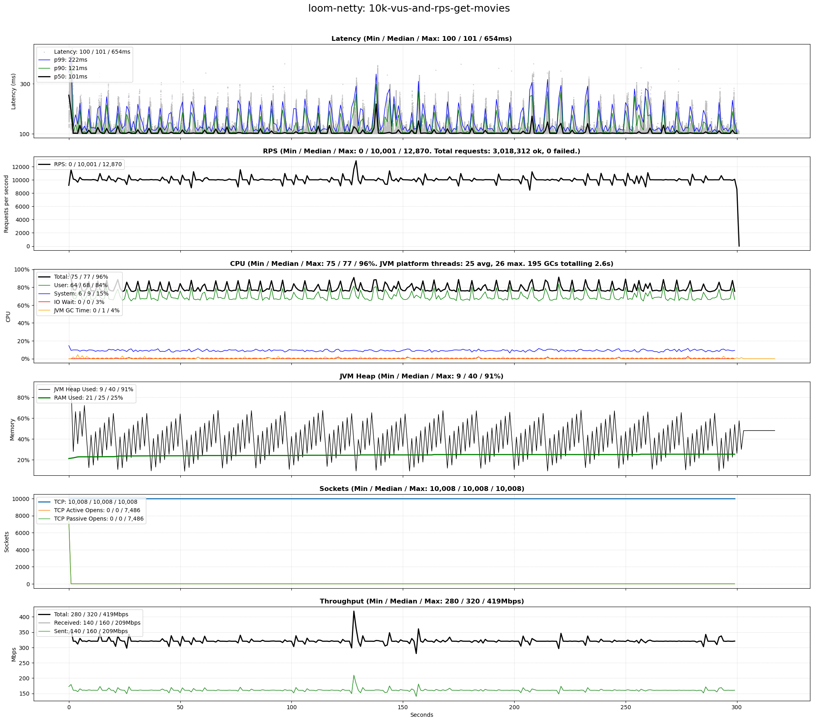
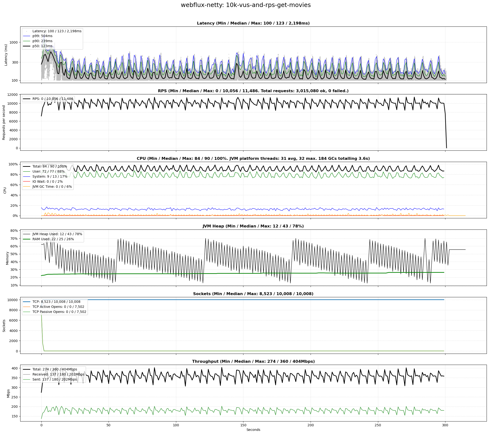
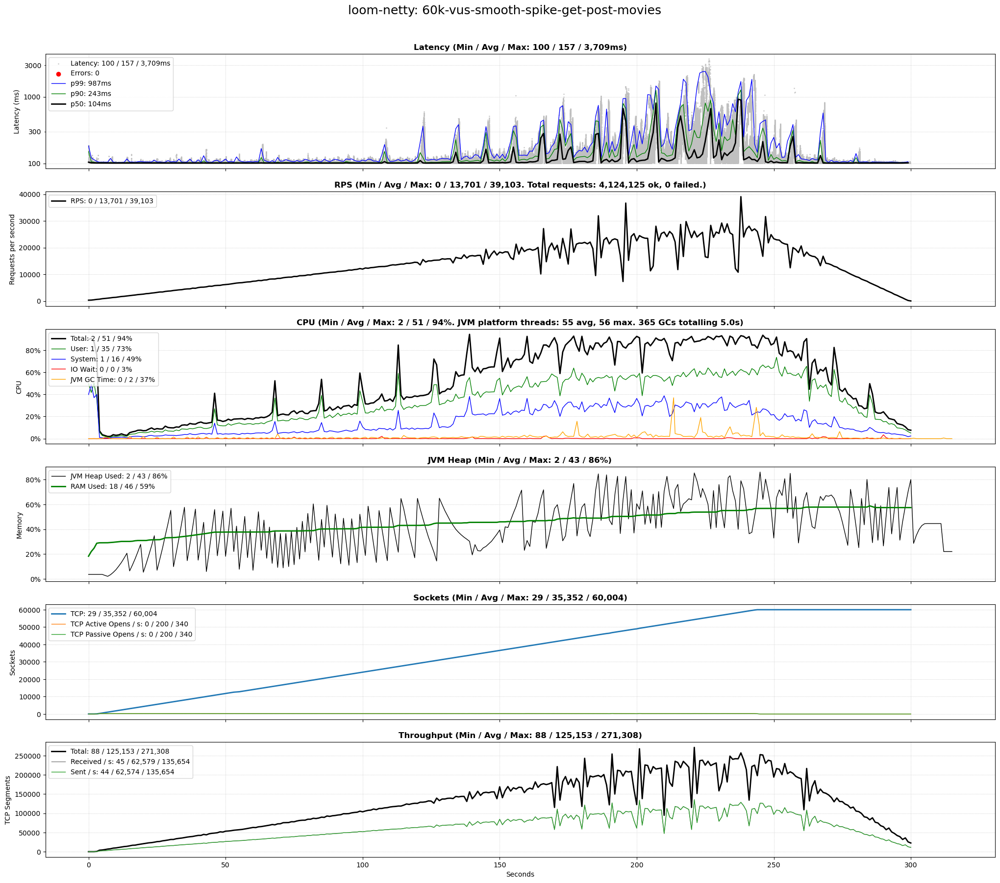
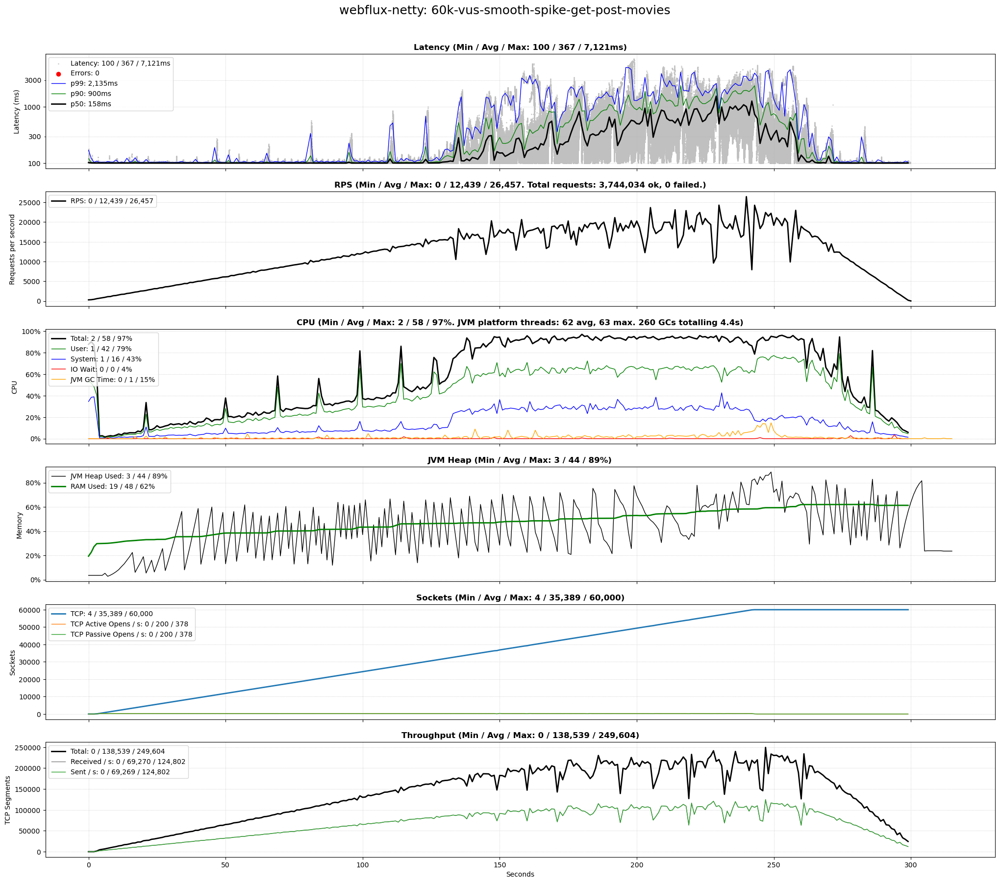

# Benchmark of Java Virtual Threads vs WebFlux

[](https://github.com/chrisgleissner/loom-webflux-benchmarks/actions)
[](https://github.com/chrisgleissner/loom-webflux-benchmarks/actions/workflows/benchmark.yaml)
[](https://github.com/chrisgleissner/loom-webflux-benchmarks/actions/workflows/soaktest.yaml)
[](https://coveralls.io/github/chrisgleissner/loom-webflux-benchmarks)

This Java 21 project benchmarks a simple [Spring Boot 3.2](https://spring.io/projects/spring-boot) HTTP endpoint using
configurable scenarios, comparing Java Virtual Threads (introduced
by [Project Loom, JEP 444](https://openjdk.org/jeps/444)) using Tomcat and Netty
with [Spring WebFlux](https://docs.spring.io/spring-framework/reference/web/webflux.html) (relying
on [Project Reactor](https://projectreactor.io/)) using Netty.

### TL;DR

High-level, the results of this benchmark are:

- Virtual Threads on Netty (
  using [blocking code](https://docs.oracle.com/javase/8/docs/api/java/lang/Thread.html#sleep-long-)) show practically
  the same performance characteristics (latency, rps,
  system load) as WebFlux (
  using [reactive code](https://projectreactor.io/docs/core/release/api/reactor/core/publisher/Mono.html)).
- For both approaches, we can scale up to the same number of virtual users (and thus TCP connections) before
  exhausting the CPU and running into time-outs due to rejected TCP connection requests.
- In some cases ([60k-vus-smooth-spike-get-post-movies](#60k-vus-smooth-spike-get-post-movies)), the 90th and 99th percentile latencies (P90 and P99)
  were considerably lower for Virtual Threads on Netty when compared with WebFlux on Netty.
- Using Virtual Threads on Tomcat is not recommended for high load: we see higher resource use compared with using
  Netty, as well as time-outs.

### Background

Both Spring WebFlux and Virtual Threads are alternative technologies to create Java microservices that support a high
number of concurrent users, mapping all incoming requests to very few shared operating system threads. This reduces the
resource overhead incurred by dedicating a single operating system thread to each user.

Spring WebFlux was first introduced in September 2017. Virtual Threads were first introduced as preview feature with
Java 19 and were fully rolled out with Java 21 in September 2023.

### Features

* Fully automated and CLI-driven via `benchmark-all.sh`.
* Test scenario support, see `config/scenario.csv`.
* Produces single PNG plot using [Matplotlib](https://matplotlib.org/) for each scenario and approach (Loom or WebFlux),
  containing:
    * Raw latencies and P50/90/99 percentiles, as well as any errors.
    * System metrics for CPU, RAM, sockets, and network throughput.
    * JVM metrics such as heap usage, garbage collections (GCs), and platform thread count.

### Design

* The benchmark is driven by [k6](https://k6.io/docs/) which repeatedly issues HTTP requests to a service listening
  at http://localhost:8080/
* The service implementation consists of 3 steps:
    1. It calls its own `/$approach/epoch-millis` endpoint recursively `$delayCallDepth` times to mimic calls to upstream service(s).
    2. It waits `$delayInMillis` (default: `100`) to mimic a network call, filesystem wait, or similar. Whilst the
       request waits, its operating system thread can be reused by another request. Both Loom and WebFlux use their
       respective idiomatic ways to wait.
    3. It then returns a response depending on the called REST endpoint.

For example, a call to get all movies with `$delayCallDepth=1` and `$delayInMillis=100` behaves as follows:

```mermaid
sequenceDiagram
    participant k6s
    participant service
    k6s->>+service: GET /$approach/movies
    service->>+service: GET /$approach/epoch-millis
    service->>service: Wait $delayInMillis
    service-->>-service: Return epoch millis
    service->>service: Find movies
    service-->>-k6s: Return movies
```

### REST APIs

The microservice under test exposes several RESTful APIs. In the following descriptions, `$approach` is the approach
under test and can be one of `loom-tomcat`, `loom-netty`, and `webflux-netty`.

All REST APIs support the following query parameters:

- `delayCallDepth`: Depth of recursive HTTP call stack to `$approach/epoch-millis` endpoint prior to server-side delay; see [Scenario Columns](#Columns) for more details.
- `delayInMillis`: Server-side delay in milliseconds; see [Scenario Columns](#Columns) for more details.

#### epoch-millis

The [TimeController](src/main/java/uk/gleissner/loomwebflux/time/TimeController.java) returns the milliseconds since the
epoch, i.e. 1 Jan 1970:

- This is one of the simplest possible APIs to provide a best-case performance scenario.
- Supported requests:
    - `GET /$approach/epoch-millis`

#### movies

The [MovieController](src/main/java/uk/gleissner/loomwebflux/movie/MovieController.java) gets and saves movies which are
stored in an in-memory repository:

- This is a realistic JSON API as exposed by a typical microservice.
- Several hard-coded movies by three directors are provided.
- By default, writes are not saved since the code under test is identical for all approaches and would thus only
  contribute to CPU use. However, this can be controlled with the Spring Boot property `loom-webflux.repo-read-only`
  in `src/main/resources/application.yaml`.
- Supported requests:
    - `GET /$approach/movies?directorLastName={director}`:
        - Returns movies by the specified director.
        - Supported `{director}` values and their respective response body size in bytes, based on the default movies:
            - `Allen`: 1597 bytes (unindented)
            - `Hitchcock`: 1579 bytes (unindented)
            - `Kubrick`: 1198 bytes (unindented)
    - `POST /$approach/movies`:
        - Saves one or more movies.
        - The [sample movies](config/movies.json) saved during the load tests measure 7288 bytes (indented).

## Requirements

### Software

* Unix-based OS; tested with Ubuntu 22.04
* Java 21 or above
* [k6](https://k6.io/docs/) and Python 3 with [Matplotlib](https://matplotlib.org/) to drive load and measure latency
* [sar/sadf](https://linux.die.net/man/1/sar) to measure system resource use
* Python 3 and [Matplotlib](https://matplotlib.org/) to convert latency and system CSV measurements into a PNG image

### Hardware

The hardware requirements depend purely on the scenarios configured in `config/scenarios.csv`. The following is
recommended to run the default scenarios committed to this repo:

* CPU comparable to Intel 6700K or above
* 16 GiB RAM

## Setup

The following instructions assume you are using a Debian-based Linux such as Ubuntu 22.04.

### Java 21

You'll need Java 21 or above:

```shell
sudo apt install openjdk-21-jdk
```

### k6

[k6](https://k6.io/docs/) is used to load the service:

```shell
sudo gpg -k
sudo gpg --no-default-keyring --keyring /usr/share/keyrings/k6-archive-keyring.gpg --keyserver hkp://keyserver.ubuntu.com:80 --recv-keys C5AD17C747E3415A3642D57D77C6C491D6AC1D69
echo "deb [signed-by=/usr/share/keyrings/k6-archive-keyring.gpg] https://dl.k6.io/deb stable main" | sudo tee /etc/apt/sources.list.d/k6.list
sudo apt-get update
sudo apt-get install k6
```

### Python 3, matplotlib, sar and sadf

Python 3 and `matplotlib` are used to convert the CSV output of `k6` and `sar`/`sadf` to a single PNG chart. The `sar`
and `sadf` tools come as part of `sysstat` and are used to measure resource use. To install them run:

```shell
sudo apt update && sudo apt install -y python3 python3-matplotlib sysstat
```

### Linux Optimizations

The following adjustments optimize Linux for HTTP load tests.

#### Increase Open File Limit

Ensure your system can handle a large number of concurrent connections:

```shell
printf '* soft nofile 1048576\n* hard nofile 1048576\n' | sudo tee -a /etc/security/limits.conf 
```

#### Increase Port Range and Allow Fast Connection Reuse

Increase the port range for outgoing TCP connections and allow quick connection reuse:

```shell
printf 'net.ipv4.ip_local_port_range=1024 65535\nnet.ipv4.tcp_tw_reuse = 1\n' | sudo tee -a /etc/sysctl.conf && sudo sysctl -p
```

#### Activate Changes

Log out and back in.

## Benchmark

The following command runs the benchmark for each combination of approaches and scenarios. Results are stored in
the `build/results` folder:

```shell
./benchmark.sh 
```

To see the available options, run `benchmark.sh -h`:

```
Usage: benchmark.sh [-h] [-a <approaches>] [-C] [FILE]
  FILE: Scenario CSV file. Default: config/scenarios.csv
  -a <approaches>: Comma-separated list of approaches to test. Default: loom-tomcat,loom-netty,webflux-netty
                   Supported approaches: platform-tomcat,loom-tomcat,loom-netty,webflux-netty
  -C               Keep CSV files used to create chart. Default: false
  -h               Print this help
```

### Approaches

- **platform-tomcat**: Platform threads using [Tomcat](https://tomcat.apache.org/) server
- **loom-tomcat**: Virtual Threads using [Tomcat](https://tomcat.apache.org/) server
- **loom-netty**: Virtual Threads on [Netty](https://netty.io/) server
- **webflux-netty**: WebFlux on Netty server

All approaches use the same Spring Boot 3.2 version.

### Scenarios

#### Standard Scenarios ([config/scenarios.csv](config/scenarios.csv))

| Scenario                                                                      | Domain | Description                           | Virtual Users (VU) | Requests per Second (RPS)   | Client delay (ms)    | Server delay (ms) | Delay Call Depth |
|-------------------------------------------------------------------------------|--------|---------------------------------------|--------------------|-----------------------------|----------------------|-------------------|------------------|
| smoketest                                                                     | Time   | Smoke test                            | 5                  | 5                           | 0                    | 100               | 0                |
| [5k-vus-and-rps-get-time](#5k-vus-and-rps-get-time)                           | Time   | Constant users, constant request rate | 5,000              | 5,000                       | 0                    | 100               | 0                |
| [5k-vus-and-rps-get-movies](#5k-vus-and-rps-get-movies)                       | Movies | Constant users, constant request rate | 5,000              | 5,000                       | 0                    | 100               | 0                |
| [10k-vus-and-rps-get-movies](#10k-vus-and-rps-get-movies)                     | Movies | Constant users, constant request rate | 10,000             | 10,000                      | 0                    | 100               | 0                |
| [25k-vus-stepped-spike-get-movies](#25k-vus-stepped-spike-get-movies)         | Movies | Stepped user spike                    | 0 - 25,000         | Depends on users and delays | 1000 - 3000 (random) | 100               | 0                |
| [25k-vus-smooth-spike-get-movies](#25k-vus-smooth-spike-get-movies)           | Movies | Smooth user spike                     | 0 - 25,000         | Depends on users and delays | 1000 - 3000 (random) | 100               | 0                |
| [25k-vus-smooth-spike-get-post-movies](#25k-vus-smooth-spike-get-post-movies) | Movies | Smooth user spike                     | 0 - 25,000         | Depends on users and delays | 1000 - 3000 (random) | 100               | 0                |

#### High-Load Scenarios ([config/scenarios-high-load.csv](config/scenarios-high-load.csv))

| Scenario                                                                      | Domain | Description       | Virtual Users (VU) | Requests per Second (RPS)   | Client delay (ms)    | Server delay (ms) | Delay Call Depth |
|-------------------------------------------------------------------------------|--------|-------------------|--------------------|-----------------------------|----------------------|-------------------|------------------|
| [60k-vus-smooth-spike-get-post-movies](#60k-vus-smooth-spike-get-post-movies) | Movies | Smooth user spike | 0 - 60,000         | Depends on users and delays | 1000 - 3000 (random) | 100               | 0                |

### Steps

The benchmark run for each `$scenario` consists of the following phases and steps:

#### Before Benchmark

* Build and start the Spring Boot service with a specific `$approach` as Spring Boot profile, using the config in `src/main/resources/application.yaml` and overridden by `src/main/resources/application-$approach.yaml` if defined.

#### Benchmark

* Run the benchmark as configured by the `$scenario`.
* For each `$resultType` (i.e. `latency`, `system`, or `jvm`), create a CSV file at `build/results/$scenario/$approach-$resultType.csv`.

#### After Benchmark

* Convert CSV files into `build/results/$scenario/$approach.png`
* Delete the CSV files unless the `-C` CLI option was specified.
* Stop the service.

## Config

### Common

- The `build.gradle` file configures the heap space to 2 GiB.
- The `src/main/resources/application.yaml` file enables HTTP/2.
- Time-out is 60s for both client and server.

### Scenario-specific

Each line in [config/scenarios.csv](config/scenarios.csv) configures a test scenario which is performed first for Java
Virtual Threads, then for WebFlux.

#### Example

| scenario                         | k6Config                               | delayCallDepth | delayInMillis | connections | requestsPerSecond | warmupDurationInSeconds | testDurationInSeconds |
|----------------------------------|----------------------------------------|----------------|---------------|-------------|-------------------|-------------------------|-----------------------|
| 5k-vus-and-rps-get-time          | get-time.js                            | 0              | 100           | 5000        | 5000              | 10                      | 300                   |
| 20k-vus-smooth-spike-get-movies] | k6-20k-vus-smooth-spike-get-movies].js | 0              | 100           | 20000       |                   | 0                       | 300                   |

#### Columns

1. `scenario`: Name of scenario. Is printed on top of each diagram.
2. `k6Config`: Name of the [K6 Config File](https://k6.io/docs/using-k6/http-requests/) which is assumed to be in
   the `config` folder
3. `delayCallDepth`: Depth of recursive HTTP call stack to `$approach/epoch-millis` endpoint prior to server-side delay.
    - Mimics calls to upstream services which allow for reuse of the current platform thread.
    - For example, a value of `0` means that the service waits for `$delayInMillis` milliseconds immediately upon receiving a request.
    - Otherwise, it calls the `$approach/epoch-millis` with `${delayCallDepth - 1}`.
    - This results in a recursive HTTP-request-based descent into the service, creating a call stack of depth `$delayCallDepth`.
3. `delayInMillis`: Server-side delay of each request, in milliseconds. Mimics a delay such as invoking a DB which allow for reuse of the current platform thread.
4. `connections`: Number of TCP connections, i.e. virtual users.
5. `requestsPerSecond`: Number of requests per second across all connections. Left empty for scenarios where the number
   of requests per second is organically derived based on the number of connections, the request latency, and any
   explicit client-side delays.
6. `warmUpDurationInSeconds`: Duration of the warm-up iteration before the actual test. Warm-up is skipped if `0`.
7. `testDurationInSeconds`: Duration of the test iteration.

## Results

## Test Environment

- Unless noted otherwise, all tests were conducted on this test environment.
- **Preparation**: The system was rebooted before each test and quieted down as much as possible. The baseline total CPU
  use before test start was 0.3%.
- **Co-location**: Test driver (k6) and server under test (Spring Boot microservice) were co-located on the same
  physical machine. The aim of this benchmark is not to achieve maximum absolute performance, but rather to compare
  different server-side approaches with each other. Considering that the test driver and the load it produced was
  identical for the combination of server-side approach and scenario, this co-location should not affect the validity of
  the test results.

### Hardware

- CPU: Intel Core i7-6700K at 4.00GHz with 4 cores (8 threads)
- Motherboard: Asus Z170-A
- RAM: 32 GiB DDR4 (2 x Corsair 16 GiB, 2133 MT/s)
- Network: Loopback interface
- Virtualization: None; bare metal desktop

### Software

- OS: Ubuntu 22.04.4 LTS
- Kernel: 5.15.86-051586-generic
- Java: Amazon Corretto JDK 21.0.3.9.1
- Spring Boot 3.2.5

## Charts

The following charts show the results of each scenario, sorted by ascending scenario load.

Any failed requests appear both in the latency chart as red dots, as well as in the RPS chart as part of a continuous
line:

- A small latency, such as 0s, indicates that the request never reached the server, typically since the client failed to
  establish a connection.
- A larger latency, especially if it is around 60s, indicates that the client didn't receive a response before the
  request timeout was reached.

### 5k-vus-and-rps-get-time

This scenario aims to maintain a steady number of 5k virtual users (VUs, i.e. TCP connections) as well as 5k requests
per second (RPS) across all users for 5 minutes:

- Each user issues a request and then waits. This wait between consecutive requests is controlled by k6 in order to
  achieve the desired number of RPS.
- The server-side delay is 100ms.
- The server returns the current millis since the epoch.

#### Virtual Threads (Tomcat)



#### Virtual Threads (Netty)


#### WebFlux (Netty)



### 5k-vus-and-rps-get-movies

Like the previous scenario, but the response body contains a JSON of movies.

For further details, please see the [movies](#movies) section.

#### Virtual Threads (Tomcat)



#### Virtual Threads (Netty)


#### WebFlux (Netty)



### 10k-vus-and-rps-get-movies

Like the previous scenario, but 10 virtual users and requests per second.

#### Virtual Threads (Tomcat)


#### Virtual Threads (Netty)



#### WebFlux (Netty)



### 25k-vus-stepped-spike-get-movies

This scenario ramps up virtual users (and thus TCP connections) from 0 to 25k in multiple steps, then back down:

- Each step has a short [riser](https://en.wikipedia.org/wiki/Stair_riser) time when users are increased,
  followed by a longer [tread](https://en.wikipedia.org/wiki/Stair_tread) time when users are held
  constant.
- Each user issues a request, waits for the response, and then waits for a random delay between 1s and 3s. This reduces
  the load and better mimics real user interactions with a service, assuming the service calls are driven by user
  interactions with a website that relies on the service under test.
- The server-side delay before returning a response is 100ms.

#### Virtual Threads (Tomcat)


#### Virtual Threads (Netty)


#### WebFlux (Netty)


### 25k-vus-smooth-spike-get-movies

Like the previous scenario, but linear ramp-up and down.

#### Virtual Threads (Tomcat)


#### Virtual Threads (Netty)


#### WebFlux (Netty)


### 25k-vus-smooth-spike-get-post-movies

Like the previous scenario, but instead of just getting movies, we are now additionally saving them:

- 75% of requests are GET requests which are split into three groups, each requesting movies by a different director.
- 25% of requests are POST requests.

For further details, please see the [movies](#movies) section.

#### Virtual Threads (Tomcat)


#### Virtual Threads (Netty)


#### WebFlux (Netty)


### 60k-vus-smooth-spike-get-post-movies

Like the previous scenario, but scaling up to 60k users and executed within a VirtualBox VM on more powerful hardware,
using a
different Linux Kernel version. The rest of the setup is identical.

#### Hardware

- CPU: Intel Core i7-12700K at 5GHz with 12 cores (20 threads)
- Motherboard: Asus ProArt Z690 Creator
- RAM: 64 GiB DDR4 (2 x Corsair 32 GiB, 5600MT/s)
- Network: Loopback interface
- Virtualization: VirtualBox 7.0.14 r161095 on bare metal desktop. All cores and 32GiB assigned to VM.

#### Software

- Host OS: Windows 11 Pro (10.0.22631)
- Client OS: Ubuntu 22.04.4 LTS
- Client Kernel: 6.5.0-28-generic
- Java: Amazon Corretto JDK 21.0.2+13-LTS
- Spring Boot 3.2.5

#### Config

The `scenario.csv` line for this run was:

```csv
60k-vus-smooth-spike-get-post-movies,get-post-movies-smooth-vus-spike.js,100,60000,,0,300
```

#### Virtual Threads (Tomcat)


#### Virtual Threads (Netty)



#### WebFlux (Netty)


